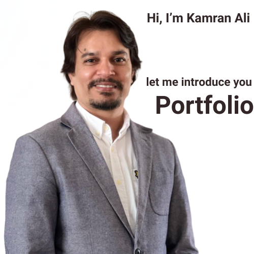
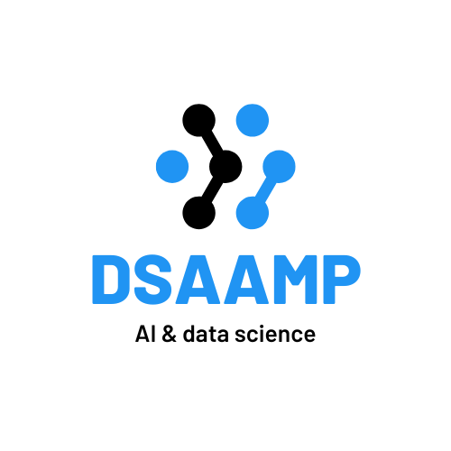

# Welcome to the Data Science world 

This is my portfolio website. Here you can find information about my projects, skills, and experience.

For full list of Project and repositories visit: [My GitHub Profile](https://github.com/alicamran).

## My Social Media links

- [LinkedIn](https://www.linkedin.com/in/kamranaliuk/)
- [facebook](https://www.facebook.com/alicamran)

## Project layout
### 🩺📊 ER Dashboard in Excel to boost efficiency & insights!
Helps stakeholders monitor, analyse & make smarter decisions for better patient care. ✅🚑

[Click Here for Dashboard & Report view in Excel Format](../assets/Hoptial project.xlsx)

#### 📊 Global Super Store Dashboard Migration Project.

[Click here for Dashboad & Report view of Global Supper store](./projects/project1.md)

#### 🌳CARBON SEQUESTRATION IN WOODLAND CITY OF LONDON

[Clik here for more details and report](./projects/project2.md)

#### 📖 eBook for kids 
#### Title: A Fun Guide to the World of Artificial Intelligence for Kids (Ages 8-10)
A Fool-Proof Future Learning Smart Things in a Simple Way 

[Click here for ebook content](./projects/test.md)

