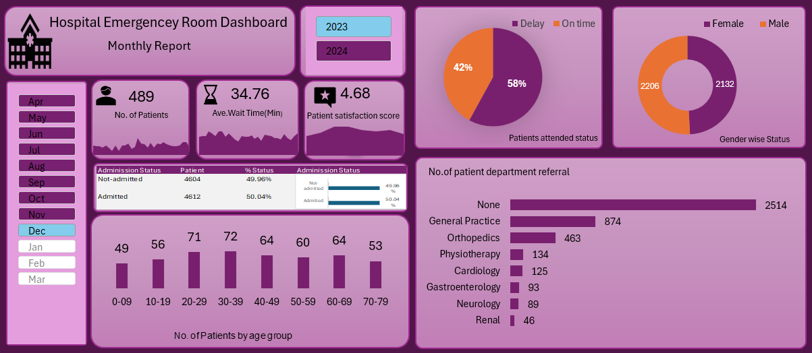

# PURPOSE OF PROJECT
  We need to create a Hospital Emergency Room Analysis Dashboard in Power BI to improve efficiency and provide useful insights. This dashboard will help stakeholders monitor, analyze, and make better decisions for managing patients and improving services
# Project Steps
### 

### 🩺 Hospital Emergency Room Dashboard in Excel to boost efficiency & insights!
Helps stakeholders monitor, analyse & make smarter decisions for better patient care.

### 
✅ Total Patients Treated: 489  
- ⏳ Average Wait Time: 34.76 minutes  
- 🌟 Patient Satisfaction Score: 4.68 / 5  
- 📈 Admission Overview  
  - Admitted: 50.04%  
  - Not Admitted: 49.96%  
- 👥 Gender Distribution  
  - Female: 2132  
  - Male: 2206  
- 🧑‍⚕️ Referral Breakdown  
  - 51% no department referral  
  - Top referrals: General Practice, Orthopaedics, Physiotherapy  
- ⏱️ Attendance Timeliness  
  - Delayed: 58%  
  - On time: 42%  
- 📊 Top Age Groups Visiting ER  
  - 20–29 and 30–39 years (highest volume)  

This data empowers us to improve service delivery continuously, reduce wait times, and enhance patient satisfaction. Healthcare analytics isn't just numbers—it's about better outcomes for everyone who walks through our doors.