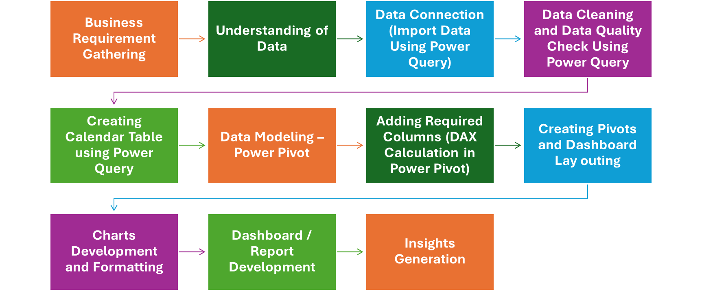

# PURPOSE OF PROJECT
 ### We need to create a Hospital Emergency Room Analysis Dashboard in Power BI to improve efficiency and provide useful insights. This dashboard will help stakeholders monitor, analyze, and make better decisions for managing patients and improving services
# Project Steps
### 

### 🩺 Hospital Emergency Room Dashboard in Excel to boost efficiency & insights!
Helps stakeholders monitor, analyse & make smarter decisions for better patient care.

[📥 Download Excel Dashboard](https://github.com/alicamran/Kamran_portfolio/raw/main/assets/Hospital_project.xlsx)
