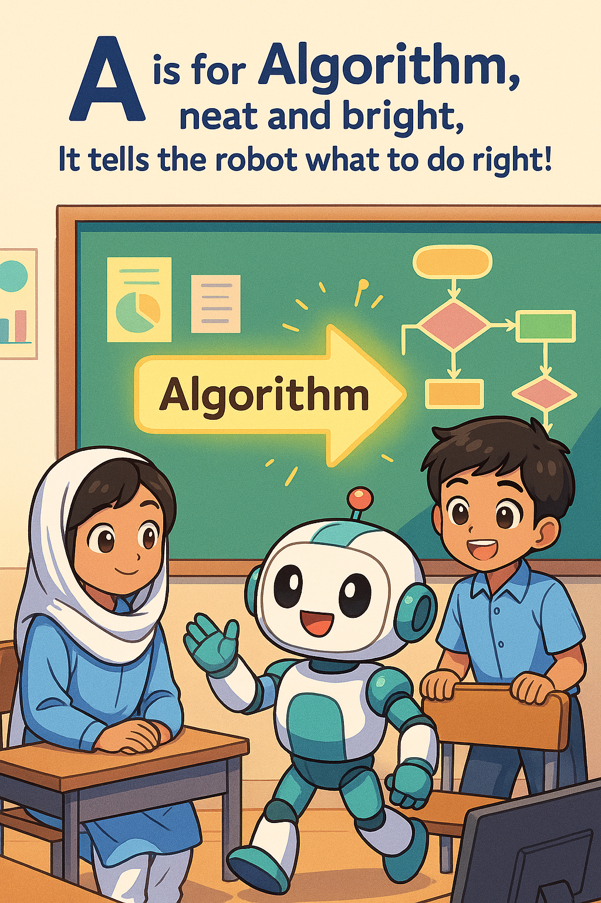

# 📖 eBook For Kids Age 8-10 Title Page

## ✅ Title: Hello AI A Fun Guide to the World of Artificial Intelligence for Kids Ages 8-10
A Fool-Proof Future – Learning Smart Things in a Simple Way
## 🔤 AI from A to Z – Rhyming Terms with (Pakistani Style)
Each alphabet term is simple, rhyming, and features basic AI/data science terms, localized and fun for young readers. 
### 📚 Author: Kamran ALI
### 📅 Date: 2025-04-19
### 📖 Book Cover
### 📖 Book Description
"Hello AI!" is a fun and interactive guide to the world of Artificial Intelligence for kids aged 8-10. This book introduces young readers to the exciting world of AI through simple explanations, engaging illustrations, and fun activities. With a focus on making complex concepts easy to understand, "Hello AI!" is the perfect starting point for kids who want to learn about technology and its impact on our lives.

🅰️ A is for Algorithm, neat and bright,

 

________________________________________
🅱️ B is for Bot, with a digital face,

  

It chats with you from any place!
Prompt:
"Anime-style robot on a phone screen chatting in Urdu and English with a smiling Pakistani boy. Bright, kid-friendly design with speech bubbles."
________________________________________
🅲 C is for Code, with lines so cool,
 

It makes things work—it’s a tech rule!
Prompt:
"Anime-style kids in a computer lab in Pakistan typing colorful block codes (like Scratch). Robot on screen smiles. Class has Urdu posters on the wall."
________________________________________
🅳 D is for Data, big and wide,

 

Machines learn when we help guide.
Prompt:
"Anime-style classroom with kids sorting colorful icons like fruits and numbers labeled 'Data'. Friendly robot helping them."
________________________________________
🅴 E is for Explore, with AI’s smart eye,

 

It sees patterns we can’t spy!
Prompt:
"Anime-style robot exploring science objects with a magnifying glass, alongside Pakistani schoolkids. Background shows stars, books, and circuits."
________________________________________
🅵 F is for Face, it knows your smile,

 

AI sees people from a mile!
Prompt:
"Anime-style robot scanning smiling faces of Pakistani kids with a digital screen. Lighthearted and playful scene."
________________________________________
🅶 G is for Game, full of fun,

 

AI learns how it’s won!
Prompt:
"Anime-style children playing a game on a tablet with a robot teammate. Pakistani living room background. Confetti for win!"
________________________________________
🅷 H is for Help, with homework too,
 

AI makes learning fun for you!
Prompt:
"Anime-style robot helping a girl with homework at home in a traditional Pakistani setup (rug, low table, book pile). Cartoon look."
________________________________________
🅸 I is for Intelligence, machine-style,

It solves hard puzzles with a smile.
Prompt:
"Anime-style robot solving a Rubik’s Cube with glowing brain circuits. Pakistani kid watching in awe."
________________________________________
🅹 J is for Joy, when tech feels right,

Learning with AI is a delight!
Prompt:
"Anime-style kids jumping with joy beside robot holding balloons. Pakistani flags in the background, festive vibe."
________________________________________
🅺 K is for Keyboard, click and learn,

Every button helps you earn!
Prompt:
"Anime-style close-up of a Pakistani child using a colorful keyboard with an excited robot beside them. Classroom with charts in Urdu."
________________________________________
🅻 L is for Learn, just like a pro,

Even machines learn as they go!
Prompt:
"Anime-style robot sitting with kids in a Pakistani school classroom learning ABCs from a chalkboard. Cute and lively design."
________________________________________
🅼 M is for Machine, built with care,

AI lives inside it somewhere!
Prompt:
"Anime-style futuristic AI machine with smiling robot peeking from inside. Pakistani kids looking amazed."
________________________________________
🅽 N is for Network, links all day,

Robots talk the digital way!
Prompt:
"Anime-style scene of multiple robots connected by glowing lines over a map of Pakistan. Kids watching in wonder."
________________________________________
🅾️ O is for Observe, it watches and sees,

Learning things like birds and bees!
Prompt:
"Anime-style robot observing nature through binoculars in a Pakistani park with kids. Trees, birds, sun."
________________________________________
🅿️ P is for Pattern, dots and shapes,

AI finds what escapes!
Prompt:
"Anime-style kid and robot sorting colorful patterns—stripes, circles, and numbers—in a game style. Background: vibrant room."
________________________________________
🆀 Q is for Question, why and how?

AI keeps asking even now!
Prompt:
"Anime-style robot and child with big question marks and thought bubbles. Classroom with ‘Why’ and ‘How’ in Urdu/English on board."
________________________________________
🆁 R is for Robot, our helper friend,

With gears and wires that never end!
Prompt:
"Anime-style friendly robot waving at Pakistani kids in school uniforms. School bags and books around."
________________________________________
🆂 S is for Smart, like you and me,

AI helps the world, you’ll see!
Prompt:
"Anime-style kids with glowing robot brain (gears and lightbulbs). Background: Pakistani science fair scene."
________________________________________
🆃 T is for Train, not on tracks,

But teaching machines new facts!
Prompt:
"Anime-style child showing flashcards to robot to ‘train’ it. Urdu-English flashcards like apple/seb, cat/billi."
________________________________________
🆄 U is for Understand, with voices too,

AI hears what’s said by you!
Prompt:
"Anime-style child speaking Urdu into a phone, AI robot responding in English. Happy, animated style."
________________________________________
🆅 V is for Voice, soft or loud,

AI listens in every crowd!
Prompt:
"Anime-style robot listening to a child’s voice using headphones. City background with mosque and school."
________________________________________
🆆 W is for World, big and wide,

AI connects from side to side!
Prompt:
"Anime-style globe showing Pakistan connected to the world with tech lines and little robots waving from countries."
________________________________________
🆇 X is for eXample, learn and copy,

Machines watch how to be happy!
Prompt:
"Anime-style robot copying a child drawing a flower. Robot's screen shows child’s art. Light, cartoon tone."
________________________________________
🆈 Y is for Yes!, when AI wins,

Helping doctors, teachers, and twins!
Prompt:
"Anime-style joyful robot in a hospital helping doctor, in a classroom helping teacher. Kids clapping ‘Yes!’"
________________________________________
🆉 Z is for Zoom, fast and keen,

AI works like a future machine

[assetImage]: ../ebook_images/A_PM.png
[image_a]: ../ebook_images/A_PM.png
[Image_b]: ../ebook_images/B_PM.png 
[Image_c]: ../ebook_images/c_PM.png
[image_d]: ../ebook_images/d_PM.png
[image_e]: ../ebook_images/e_PM.png
[image_f]: ../ebook_images/f_PM.png
[image_g]: ../ebook_images/g_PM.png
[image_h]: ../ebook_images/h_PM.png
[image_i]: ../ebook_images/i_PM.png
[image_j]: ../ebook_images/j_PM.png
[image_k]: ../ebook_images/k_PM.png
[image_l]: ../ebook_images/l_PM.png
[image_m]: ../ebook_images/m_PM.png
[image_n]: ../ebook_images/n_PM.png
[image_o]: ../ebook_images/o_PM.png
[image_p]: ../ebook_images/p_PM.png
[image_q]: ../ebook_images/q_PM.png
[image_r]: ../ebook_images/r_PM.png
[image_s]: ../ebook_images/s_PM.png
[image_t]: ../ebook_images/t_PM.png
[image_u]: ../ebook_images/u_PM.png
[image_v]: ../ebook_images/v_PM.png
[image_w]: ../ebook_images/w_PM.png
[image_x]: ../ebook_images/x_PM.png
[image_y]: ../ebook_images/y_PM.png
[image_z]: ../ebook_images/z_PM.png